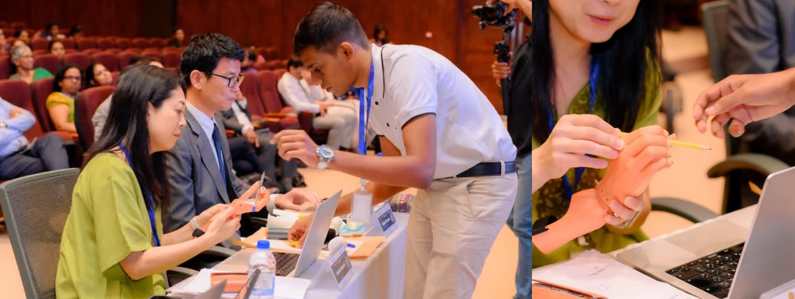

  

  

<h1 align="center">Hi there 👋, I'm Sahan Cooray</h1>

---

🚀 I'm a second-year Biomedical Engineering undergraduate at the **University of Moratuwa**, passionate about fusing healthcare with innovation. My core interests lie in **myoelectric prosthetics**, **EMG-based projects**, **human-computer interaction (HCI)**, and **3D-printed medical assistive devices**. As the **COO and Director of Rysera Innovations (Pvt) Ltd**, a multidisciplinary engineering startup founded by UoM undergraduates, I lead our **3D printing division**, pioneering low-cost, customized prosthetics and orthoses for underserved communities in Sri Lanka. Collaborating closely with **occupational therapists**, we're delivering impactful assistive solutions across the country. I also specialize in advanced prosthetic design using **Geomagic Freeform Plus** with a haptic device, enabling precise, patient-specific modeling. With a strong foundation in biomedical innovation and a drive to make healthcare more accessible, I aim to bridge the gap between cutting-edge engineering and real-world clinical needs.

---

### 🧠 Areas of Interest

- 🦿 Myoelectric Prosthetics   
- 💪 EMG Signal Processing & Analog Muscle Interfaces  
- 🖥️ Human-Computer Interaction (HCI)  
- 🖨️ 3D-Printed Medical Assistive Devices  
- 🖐️ Prosthetics & Orthotics Design (Geomagic Freeform + Haptic device)  
- 🧪 Biomedical Instrumentation  
- 📱 Mobile Health & Healthcare App Development  

---

### 📫 Let's Connect!

- 💼 LinkedIn: www.linkedin.com/in/sahan-cooray-biomedicalengineer

- 📧 Email: sahantharuka2002@gmail.com

---

